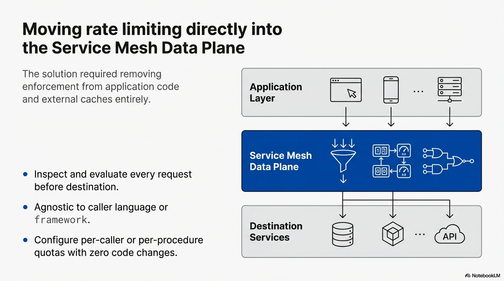
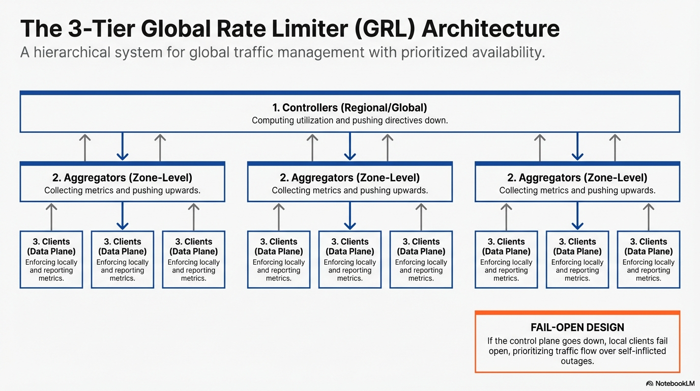

# Global Rate Limiting

A distributed global rate limiting system implemented using Spring Boot and Redis. This project demonstrates a hierarchical rate limiting architecture involving client-side sidecars, zone aggregators, and a global controller.

> **Note**: In a production environment, each of the components below would typically be deployed as a standalone service or sidecar container. They are co-located in this single project for simplicity and demonstration purposes.

## Architecture

The system consists of four main components:

1.  **Sidecar (`RateLimitClientFilter`)**:
    -   Intercepts incoming HTTP requests.
    -   Enforces rate limits locally based on a probability drop ratio.
    -   Asynchronously reports request counts to the Aggregator.
    -   Fetches the latest drop ratio from the Aggregator.

2.  **Aggregator (`ZoneAggregatorController`)**:
    -   Receives metrics from sidecars.
    -   Aggregates counts into Redis (per zone).
    -   Returns the current global drop ratio to sidecars.

3.  **Global Controller (`GlobalController`)**:
    -   Periodically scans all zone counters in Redis.
    -   Calculates the total global QPS.
    -   Computes a new global drop ratio if the limit is exceeded.
    -   Updates the global drop ratio in Redis.
    -   Allows dynamic updates to the Global QPS Limit.

4.  **Dynamic Configuration Job** (Conceptual):
    -   An autonomous job that runs on a fixed schedule or when configuration changes.
    -   Collects metrics from the system's observability platform (simulated).
    -   Computes safe limits based on historical peaks and buffer headroom.
    -   Updates the Global Rate Limiter with the new limits.


## Prerequisites

-   Java 17
-   Maven
-   Redis (running on localhost:6379 by default)

## Getting Started

1.  **Start Redis**:
    Ensure you have a Redis instance running.
    ```bash
    docker run -p 6379:6379 redis
    ```

2.  **Build the project**:
    ```bash
    ./mvnw clean install
    ```

3.  **Run the Application**:
    ```bash
    ./mvnw spring-boot:run
    ```

## Configuration

-   **Global QPS Limit**: Initially set to `10000` in `GlobalController.java`, but can be updated dynamically.
-   **Aggregator URL**: Configured in `RateLimitClientFilter.java` (default: `http://zone-aggregator-service/api/aggregator`).
    > **Note**: For local testing, you might need to update the `AGGREGATOR_URL` in `RateLimitClientFilter.java` to point to `http://localhost:8080/api/aggregator` (or your running port).
-   **Zone ID**: Default is `us-east-1`.

## Workflow

1.  Traffic hits the application.
2.  `RateLimitClientFilter` checks if the request should be dropped based on `currentDropRatio`.
3.  Every second, the filter reports the request count to the Aggregator.
4.  The Aggregator updates Redis and returns the current drop ratio.
5.  The `GlobalController` runs every second, sums up traffic from all zones, calculates the new drop ratio, and updates Redis.
6.  (Optional) An external job or service calls `GlobalController.updateGlobalQpsLimit()` to adjust the limit based on historical data and traffic patterns.

## Technologies

-   Spring Boot 4.0.3
-   Spring Data Redis
-   Spring Web
